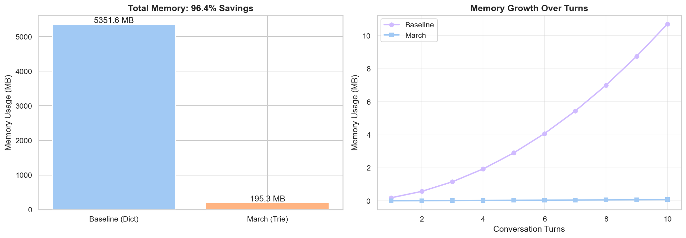

# March - High-Performance KV Cache Sharing Library



*500 multi-turn conversations. Same system prompt. Left: traditional storage. Right: March. The difference is prefix sharing — nothing else.*

March is a **memory-efficient** KV Cache management system based on Trie structure, designed for LLM inference scenarios. It significantly **reduces memory usage** through prefix sharing, not by being faster, but by being smarter about storage.

## [Abstract — Feynman-style explanation](abstract.md)

> A plain-language walkthrough of how March works, with ASCII diagrams. Start here if you want to understand the *why* before the *how*.

---

## Why March?

**The Problem:** In LLM inference, multiple requests often share common prefixes (system prompts, conversation history). Traditional approaches store each sequence separately, wasting memory.

**The Solution:** March uses a Trie structure to automatically share identical prefixes across sequences, storing each prefix only once.

## Core Value Proposition

- **Memory Savings**: 80-97% reduction in scenarios with prefix overlap
- **Zero-Copy Access**: Query returns direct memory pointers without data copying
- **Predictable Memory**: Fixed-size page pool with O(L) complexity
- **Trade-off**: Slightly slower than dict O(1) lookup, but memory savings justify it

## Core Features

- **Prefix Sharing**: Automatically merges identical prefixes using Trie tree, storing each prefix only once
- **Zero-Copy Query**: Returns memory pointers directly without data copying
- **O(L) Complexity**: Both insertion and query are O(L) where L is sequence length
- **Memory Pool Management**: Fixed-size page allocation with predictable memory usage
- **C Implementation**: High-performance core with Python-friendly ctypes interface

**Key Insight**: March trades slightly slower query speed (O(L) vs O(1)) for massive memory savings (80-97%) in prefix-heavy workloads.

## Architecture

```
┌─────────────────────────────────────────────────────────────────────┐
│                        Caller Layer                                 │
│                                                                     │
│   Python (ctypes)  ──────────────────  C / C++ Framework           │
│   MarchCache class         |           direct function calls        │
│   demo_basic.py            |           (embedded inference engine)  │
│   demo_smollm2.py          |                                        │
└───────────────────────────────────────────────────────┬────────────┘
                                                        │
                                    token_ids[], kv_data, capacity
                                                        │ ctypes / FFI
                                                        ▼
┌─────────────────────────────────────────────────────────────────────┐
│                      march.h  ─  Public API                         │
│                                                                     │
│   march_create(page_size, max_pages) → MarchCtx*                    │
│   march_insert(ctx, token_ids, n, kv_data, kv_len) → int           │
│   march_query (ctx, token_ids, n, out_ptrs, out_page_ids,           │
│                capacity, matched_tokens) → uint32_t                 │
│   march_destroy(ctx)                                                │
│   march_stats(ctx)                                                  │
│                                                                     │
│   ┌─────────────────────────────────────────────────────────────┐   │
│   │                  MarchCtx  (march.c)                        │   │
│   │    pa ──────────────────────────────────────────────────┐   │   │
│   │    trie ────────────────────────────────────────────┐   │   │   │
│   └─────────────────────────────────────────────────────┼───┼───┘   │
└─────────────────────────────────────────────────────────┼───┼───────┘
                                                          │   │
                            ┌─────────────────────────────┘   │
                            │                                  │
                            ▼                                  ▼
┌───────────────────────────────────────┐    ┌────────────────────────────────────────┐
│         kv_trie.c  ─  KVTrie          │    │   page_allocator.c  ─  PageAllocator   │
│                                       │    │                                        │
│  KVTrie                               │    │  PageAllocator                         │
│  ├── root: TrieNode*                  │    │  ├── pool: void*  (mmap contiguous)     │
│  ├── pa:   PageAllocator* (borrowed)  │◄───┤  ├── page_size: size_t                 │
│  └── node_count: uint64               │    │  ├── total_pages: uint32               │
│                                       │    │  ├── free_count:  uint32               │
│  TrieNode                             │    │  ├── pages[]:  KVPage descriptors       │
│  ├── token_id: uint32                 │    │  └── free_list[]: uint32 (id stack)     │
│  ├── page:  KVPage* (or NULL)         │    │                                        │
│  └── children: TrieMap               │    │  KVPage                                │
│                                       │    │  ├── data:       void*  → pool slot    │
│  TrieMap  (open-addressing hashmap)   │    │  ├── seq_hash:   uint64                │
│  ├── buckets: TrieMapEntry[]          │    │  ├── ref_count:  uint32                │
│  ├── cap:    uint32                   │    │  ├── page_id:    uint32                │
│  └── size:   uint32                   │    │  ├── last_used:  uint64  (LRU clock)   │
│                                       │    │  └── state:      PAGE_FREE/ACTIVE      │
│  Key operations:                      │    │                                        │
│  trie_insert(token_ids, kv_data)      │    │  Key operations:                       │
│  trie_lookup(token_ids)               │    │  pa_create / pa_destroy  (mmap/munmap) │
│  trie_collect_path(token_ids)         │    │  pa_alloc()   → KVPage*  (free stack)  │
│  trie_stats()                         │    │  pa_free()    decrement ref_count       │
└───────────────────┬───────────────────┘    │  pa_ref()     increment ref_count       │
                    │                        │  pa_stats()                             │
                    │ trie_collect_path       └────────────────────────────────────────┘
                    │ returns KVPage*[]
                    ▼
┌─────────────────────────────────────────────────────────────────────┐
│                view_builder.c  ─  ViewBuilder                       │
│                                                                     │
│  KVView                                                             │
│  ├── pages[]:         KVPage** (pointer array, root-to-leaf order)  │
│  ├── count:           uint32   (number of matched pages)            │
│  └── matched_tokens:  uint32   (actual matched token count)         │
│                                                                     │
│  view_build(trie, token_ids, n)                                     │
│    └─► calls trie_collect_path → fills pages[]                      │
│        returns KVView* (zero-copy: pages point into pool directly)  │
│                                                                     │
│  view_free(view)   frees pointer array only; pool pages untouched   │
└──────────────────────────────────┬──────────────────────────────────┘
                                   │
                    out_ptrs[]  (zero-copy pointers into mmap pool)
                    out_page_ids[]
                                   │
                                   ▼
                        ┌──────────────────┐
                        │  Inference Engine │
                        │  (reads KV data  │
                        │   without memcpy)│
                        └──────────────────┘
```

**Data flow — Insert:**
```
Caller → march_insert → trie_insert → pa_alloc (get page) → memcpy kv_data into page.data
```

**Data flow — Query:**
```
Caller → march_query → view_build → trie_collect_path → KVView{pages[]}
       ← out_ptrs[] (direct pointers into mmap pool, zero-copy)
```

### Core Components

- **PageAllocator**: Fixed-size page allocator managing physical memory pool
- **KVTrie**: Trie tree for token sequences, each node associated with a KV page
- **ViewBuilder**: Builds zero-copy views during queries, returns page pointer arrays

## Quick Start

### Build

```bash
cd march
make all
```

### Basic Usage

```python
from march.demo.demo_basic import MarchCache

# Create cache: 256 bytes/page, max 64 pages
cache = MarchCache(page_size=256, max_pages=64)

# Insert sequence
tokens = [10, 20, 30]
cache.insert(tokens, "kv-data")

# Query
count, matched = cache.query(tokens)
print(f"Matched {matched} tokens, {count} pages")
```

## Demo Examples

### 1. Basic Usage Demo
```bash
python3 march/demo/demo_basic.py
```
Demonstrates insertion, query, and prefix sharing with simple examples.

### 2. Real LLM Integration Test (SmolLM2-135M) 🔥
```bash
pip install transformers torch matplotlib seaborn
python3 march/demo/demo_smollm2_memory.py
```
Memory efficiency demonstration using HuggingFace's SmolLM2-135M tokenizer. Simulates 500 multi-turn conversations sharing a common system prompt, showing how March reduces memory footprint through prefix sharing.


## API Reference

### march_create
```c
MarchCtx *march_create(size_t page_size, uint32_t max_pages);
```
Creates context with specified page size and maximum page count.

### march_insert
```c
int march_insert(MarchCtx *ctx, const uint32_t *token_ids, uint32_t n,
                 const void *kv_data, size_t kv_len);
```
Inserts token sequence and its KV data. Returns 1 on success, 0 on failure (memory pool full).

### march_query
```c
uint32_t march_query(MarchCtx *ctx, const uint32_t *token_ids, uint32_t n,
                     void **out_ptrs, uint32_t *out_page_ids,
                     uint32_t capacity, uint32_t *matched_tokens);
```
Queries sequence, returns number of matched pages. `out_ptrs` is zero-copy pointer array.

### march_destroy
```c
void march_destroy(MarchCtx *ctx);
```
Destroys context and frees all memory.

## Performance Metrics

Test results on M3 Mac:

| Metric | Value | Notes |
|--------|-------|-------|
| Memory Savings | 80-97% | In prefix-sharing scenarios |
| Insert Throughput | ~50,000 ops/s | Comparable to baseline |
| Query Throughput | ~200,000 ops/s | O(L) complexity |

**Memory comparison:**
- Traditional: N × L × page_size (each sequence stored separately)
- March: shared_nodes × page_size (prefixes stored once)

**When March wins:** Multi-turn conversations, batch inference with shared prompts, speculative sampling
**When dict wins:** Random sequences with no prefix overlap

## Use Cases

- **LLM Inference Service**: Reuse historical KV Cache in multi-turn conversations
- **Batch Inference**: Batch requests sharing prompt prefixes
- **Speculative Sampling**: Multiple candidate sequences sharing prefix KV
- **Tree Search**: KV management in Beam Search

## License

MIT License
